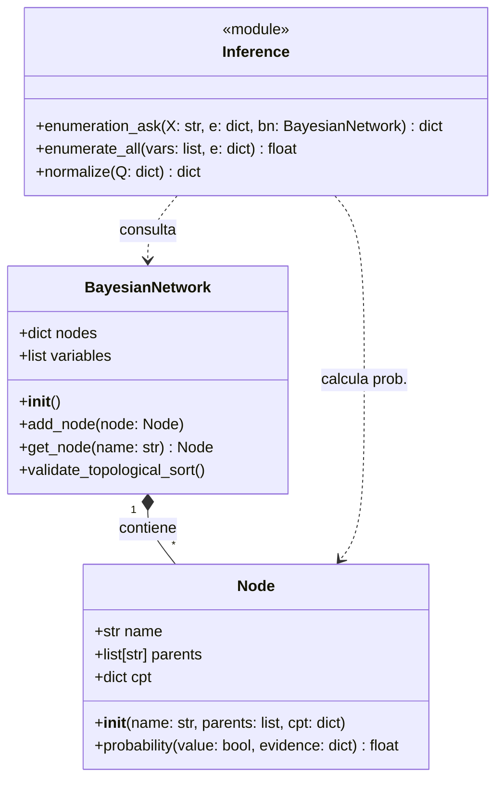
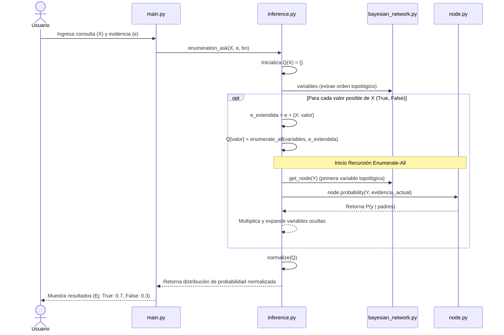

# Diseño de la Aplicación (Técnico)

Este documento describe la estructura y el diseño técnico del sistema de **Bayes Web Diagnosis**. La aplicación evalúa de forma probabilística la causa de fallas en una aplicación web distribuida mediante redes bayesianas.

## 1. Arquitectura General y Módulos

El sistema está dividido en cinco módulos lógicos principales diseñados para reducir el acoplamiento y seguir el principio de responsabilidad única (Single Responsibility Principle):

*   **`main.py`**: Interfaz de línea de comandos (CLI). Maneja el flujo de interacción con el usuario, solicitando las variables evidencias e imprimiendo los resultados.
*   **`node.py`**: Estructura base de datos. Representa la entidad atómica fundamental de la red bayesiana (variables aleatorias temporales).
*   **`bayesian_network.py`**: Contenedor lógico estructural que agrupa a todos los nodos, manteniendo referencias a su orden topológico (esencial para el algoritmo de enumeración).
*   **`inference.py`**: El motor matemático del proyecto. Contiene la ejecución del algoritmo de inferencia exacta por enumeración (*Enumeration-Ask*).
*   **`scenarios.py`**: Entorno de validación automatizada que contiene pruebas parametrizadas predefinidas para validar fallas conocidas.

## 2. Diagrama Estructural (Clases)

Para el modelado de la red bayesiana se usan principalmente dos clases `Node` y `BayesianNetwork`. 



### Explicación de Atributos Críticos
*   **`Node.cpt` (Conditional Probability Table)**: Se implementará utilizando diccionarios en Python donde las llaves (`keys`) serán tuplas booleanas que representan los valores de los padres en el mismo orden que están en la lista `parents`.
*   **`BayesianNetwork.variables`**: Representa el orden causal y topológico de las variables ($X_1, X_2, \dots, X_n$). Es un pre-requisito obligatorio para que `enumerate_all` funcione sin re-evaluar dependencias de forma errónea.

## 3. Diagrama de Comportamiento (Secuencia de Inferencia)

El proceso principal de la aplicación es calcular la distribución $P(X | \text{evidencia})$. El motor funciona mediante inferencia por enumeración siguiendo el enfoque top-down recursivo.



## 4. Estructuras de Datos Propuestas

### Representación de la CPT (Tabla Condicional)
Para un nodo con padres, la CPT es un mapeo indexado por el estado de sus padres. 

```python
# Ejemplo para Node('Error500', parents=['BaseDatosCaida', 'BackendSaturado'])
cpt = {
    (True, True): 0.95,
    (True, False): 0.85,
    (False, True): 0.70,
    (False, False): 0.05
}
```
Esto garantiza un orden de acceso de tiempo constante $O(1)$ cuando el motor de inferencia necesite extraer $P(\text{hijo} | \text{padres})$.

## 5. Complejidad y Escalabilidad

Al emplear inferencia rigurosa por enumeración exacta, el tiempo en el peor de los casos del sistema asintóticamente es $O(2^n)$ donde $n$ es el número de variables de la red, siendo así ideal funcionalmente para problemas acotados en número de variables como el esquema actual. Se priorizó la claridad educativa (siguiendo estrictamente a Russell & Norvig) frente a algoritmos aproximados (como MCMC).
